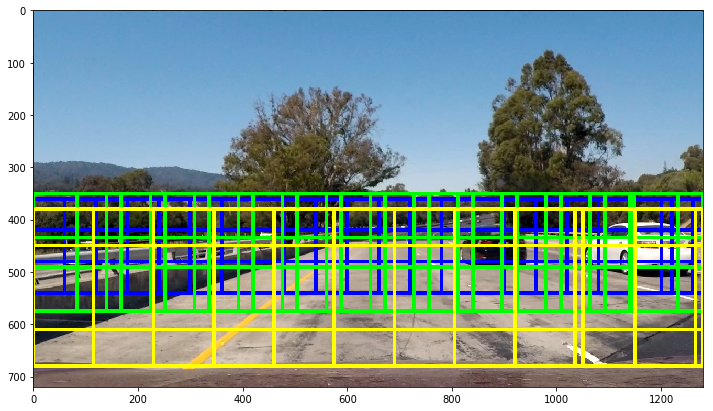

#**Self-Driving Car Nanodegree** 
##**Project 5 - Vehicle Detection and tracking** 
**Ricardo Picatoste**

##Writeup 

The goals / steps of this project are the following:

* Perform a Histogram of Oriented Gradients (HOG) feature extraction on a labeled training set of images and train a classifier Linear SVM classifier
* Optionally, you can also apply a color transform and append binned color features, as well as histograms of color, to your HOG feature vector. 
* Note: for those first two steps don't forget to normalize your features and randomize a selection for training and testing.
* Implement a sliding-window technique and use your trained classifier to search for vehicles in images.
* Run your pipeline on a video stream (start with the test\_video.mp4 and later implement on full project\_video.mp4) and create a heat map of recurring detections frame by frame to reject outliers and follow detected vehicles.
* Estimate a bounding box for vehicles detected.

---
###Writeup / README

####1. Provide a Writeup / README that includes all the rubric points and how you addressed each one.  You can submit your writeup as markdown or pdf.  

This document is the writeup.

---
###Histogram of Oriented Gradients (HOG)

####1. Explain how (and identify where in your code) you extracted HOG features from the training images.

The code related to the HOG features extraction is in the module called `classifier.py`. To train the classifier with the parameters chosen, the module `parameters.py`, where all the configurable parameters for this project are stored, must be run. These module have been done to ease testing different configurations and see quickly the effect. 

When a set of parameters is run, the resulting HOG feature extraction is shown. In this way is very easy to try different values and appreciate if they give a good impression about if the hog features will emphasize differences between cars and not cars, and if it will be too much information or just enough.

Below an example for a car and a not-car are shown with the parameters selected. The original image and the 3 hog channel features are shown.

####2. Explain how you settled on your final choice of HOG parameters.

The parameters have been selected basically by trial and error, and a bit of common sense. Some attempts would clearly not provide enough information, whilst others looked good, but had to be fine-tuned once in the video generation. The module described in the previous point is used to iterate quickly with different parameters.

####3. Describe how (and identify where in your code) you trained a classifier using your selected HOG features (and color features if you used them).

To provide more flexibility and the possibility to fit to more complex data, I used the non-linear SVM (the SVC). The parameters are basic ones recommended, and they worked fine just like that. The accuracy achieved is above 99%.

To assure that the training set is the expected, the module will also print a random set of car and not-car before training, as shown below:

Then the features for each dataset are extracted, using hog and color histogram. The spatial features were not helping during the tests, in fact showing a poorer capability to detect cars in the images.

---
###Sliding Window Search

####1. Describe how (and identify where in your code) you implemented a sliding window search.  How did you decide what scales to search and how much to overlap windows?

The search window functions are implemented in the module `search_and_classify.py`. Once again, in `parameters.py` we can choose the characteristic of the grid of image patches that will be passed to the classifier. In parameters there is a dictionary defining the different aspects of these windows, and when the module is executed, the selected grid is plot over an example image, like below.

The selected grid scans for big cars that are near the bottom part of the image, middle sized a bit above, and small in the top of the relevant part of the image (where there is road). Normally the size in the image will correspond to those windows positions.

The sizes, overlaps and limits per kind of window where select by iterating over them and checking the plot above. I selected one where the cars seemed to fit in the different window sizes. 

####2. Show some examples of test images to demonstrate how your pipeline is working.  What did you do to optimize the performance of your classifier?

The final parameters are in the parameters module. I chose YUV color space after trying HSL with less accuracy. I played with the HOG pixels and blocks, and in the end I had to us a relatively dense grid of windows to search, which made it quite slow for computation. A couple of images are shown below. 

---

### Video Implementation

####1. Provide a link to your final video output.  Your pipeline should perform reasonably well on the entire project video (somewhat wobbly or unstable bounding boxes are ok as long as you are identifying the vehicles most of the time with minimal false positives.)

The video obtained can be seen [here](https://youtu.be/3GyVa2nEB9I).

####2. Describe how (and identify where in your code) you implemented some kind of filter for false positives and some method for combining overlapping bounding boxes.

For each frame of the video the heat pipeline was applied. The heatmap is held between frames, but "cooled down" every time to remove the areas were there was a car, but is not there anymore. 

In this way, with the proper threshold, the single false detection pass without being plot, and a frame with a worst detection over a car is compensated when it has been detected reliably before.

The label functions from scipy is used to get the final box bounding the detected car, since each car appears in several boxes from the grid presented before.

The heatmap in action is shown in the previous point, together with the pipeline for car detection.

---

###Discussion

####1. Briefly discuss any problems / issues you faced in your implementation of this project.  Where will your pipeline likely fail?  What could you do to make it more robust?

I tried to do all the examples given during the lessons, which finally were very helpful. I tried the code in the most clean and user-friendly way, so I could easily test different parameters and quickly get the results. 

Finding a combination of parameters and the way to have a heatmap between frames that provides a proper detection between video frames has been hard, with many failed attempts. Finally I opted to use the smaller dataset, as it was more manageable training the SVC many times. 

